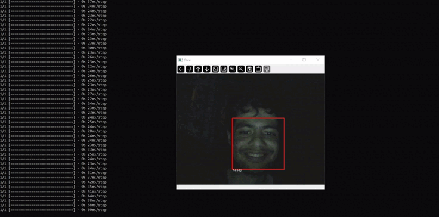
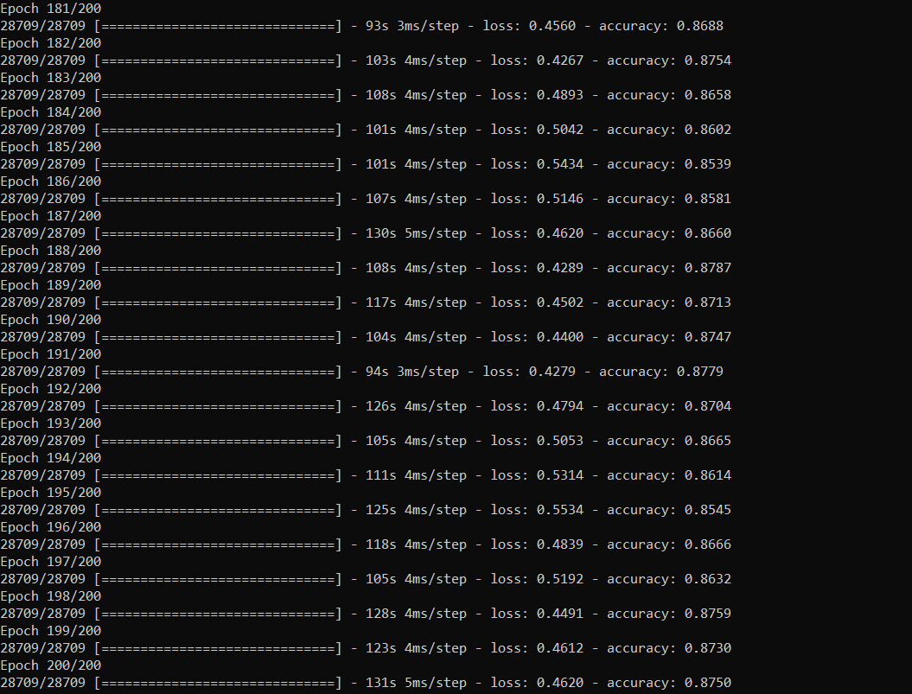

# Face Emotion Recognition

This project is an implementation of facial emotion recognition using convolutional neural networks. It is capable of
detecting and categorizing facial emotions into the following categories:

* Angry
* Disgusted
* Fearful
* Happy
* Neutral
* Sad
* Surprised



## Training Models

For training models, I utilized Kaggle data. The prediction accuracy of the models is above 87 percent, as shown
below:
<p align="left">

</p>

You can improve the accuracy by adjusting hyperparameters or implementing data augmentation techniques.

# Installation

1. Clone this project:

```
git clone https://github.com/ErfanMomeniii/face-emotion-recognition.git
```

2. Install the required libraries:

```
pip install -r requirements.txt
```

3. Download the Kaggle data and store it in the `/dataset/` folder.
4. Train the model and run it to capture and recognize facial emotions:

```
python face-emotion-recognition.py
```

## Data Reference

Data source: [Emotion Detection FER Dataset](https://www.kaggle.com/datasets/ananthu017/emotion-detection-fer)

## Related Papers

- [Facial Emotion Recognition Using Deep Convolutional Neural Networks](https://www.sciencedirect.com/science/article/abs/pii/S2214785321051567)
- [Facial Expression Recognition Using Convolution Neural Networks](https://ieeexplore.ieee.org/document/9302866)
- [Facial Emotion Recognition Based on Convolutional Neural Networks](https://ieeexplore.ieee.org/document/9641578)
